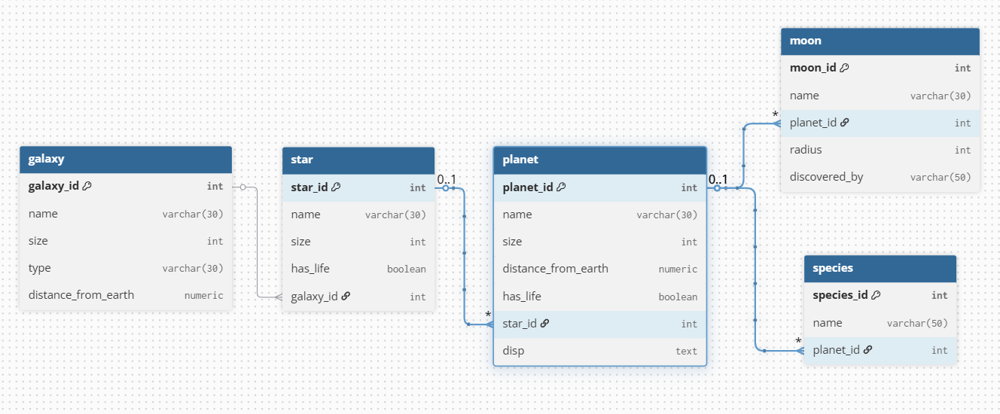

# 🌌 Universe Database Project

This project represents a fictional universe modeled using a PostgreSQL relational database. It was created as part of a FreeCodeCamp backend SQL project.

## 🧾 Description

The database models hierarchical cosmic entities and includes:

- **Universe** → Galaxy → Star → Planet → Moon
- Additional table: **Species** (linked to Planet)

It includes realistic and fictional data to illustrate relational integrity and complex references.

## 🛠️ Tables Overview

| Table     | Description                                           |
|-----------|-------------------------------------------------------|
| `galaxy`  | Galaxies with type, size, and distance from Earth     |
| `star`    | Stars with size, life presence, and galaxy reference  |
| `planet`  | Planets with size, distance, life flag, and star link |
| `moon`    | Moons with radius and discoverer, linked to planets   |
| `species` | Intelligent species tied to specific planets          |

## 📊 Entity-Relationship Diagram



## 🗃️ Setup Instructions

1. Make sure PostgreSQL is installed.
2. Clone this repo:
   ```bash
   git clone https://github.com/Abhijay30/universe-database-project.git
   cd universe-database-project
